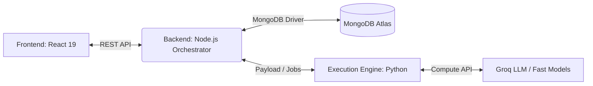
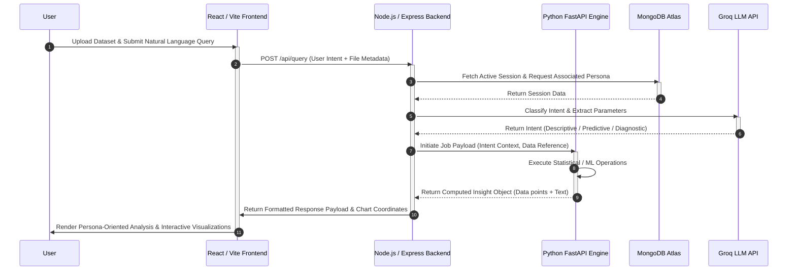

<div align="center">
  

  # Bolt — Unified Analytical Platform
  
  **Ask questions in plain language. Get rigorous, persona-aware insights powered by a decoupled LLM architecture and a pure-math Python execution engine.**

  [](https://opensource.org/licenses/MIT)
  [](https://reactjs.org/)
  [](https://nodejs.org/)
  [](https://www.python.org/)
  [](https://vitejs.dev/)

  [Features](#key-features) •
  [Architecture](#architecture-and-workflow) •
  [Project Structure](#project-structure) •
  [Quick Start](#complete-setup-and-installation) •
  [Deployment](#deployment-specifications)
</div>

---

## Introduction

**Bolt** is an enterprise-grade, conversational analytics platform developed for the NatWest Hackathon. It bridges the gap between natural language processing and complex data analytics. Whether you're an Executive looking for high-level summaries or an Analyst diving into predictive trends, Bolt morphs to fit your needs. It natively supports 11 languages, voice-to-text, and a fully blind-accessible audio mode.

## Key Features

### Powerful Data Engine
- **Universal CSV Loader**: Automatically detects encodings (UTF-8, ISO-8859, etc.) and interprets 7 different date formats.
- **Advanced Analytics**:
  - **Diagnostic**: Z-Score Anomaly Detection with auto-root-cause analysis.
  - **Predictive**: 6-Month forecasting with MAPE calculations and confidence intervals.
  - **Comparative**: Period-Over-Period delta analysis with dynamic metric-aware titles.
- **Rich Visualizations**: Recharts-based multi-tier render engine supporting Waterfalls, Diverging Bars, Composed Charts, and more.

### Universal Accessibility
- **Global i18n**: Native support for 11 languages (English, Hindi, Bengali, Telugu, Marathi, Tamil, Spanish, French, Mandarin, Arabic, German).
- **RTL Support**: Flawless Arabic Right-to-Left layout rendering.
- **Blind Mode (A11y)**: Hold `Spacebar` for 5s to activate an immersive Web Speech API-driven blind mode with vocal navigation.
- **Voice Input**: Speak your analytics questions natively into the microphone.

### Intelligent UX
- **6 Persona Modes**: Switch instantly between Beginner, Everyday, SME, Executive, Analyst, and Compliance views. Responses automatically re-render without hitting the API again.
- **Dynamic Schema Detection**: Instantly profiles uploaded CSVs to ground the LLM, preventing hallucinated variables.
- **Session Persistence**: Continuous chats powered by MongoDB with a fast LocalStorage caching mechanism.

---

## Architecture and Workflow

Bolt utilizes a robust, decoupled 3-tier structure to isolate fast UX from heavy computation.

### Structural Breakdown



| Layer | Port | Stack | Purpose |
|-------|------|-------|---------|
| **Frontend** | `5173` | React, Vite, TS | UI, Persona Switcher, i18n, Web Speech API, Charting |
| **Backend** | `5000` | Node.js, Express | LLM orchestration (Groq), Intent Classification, Auth |
| **Engine** | `8000`| Python, FastAPI | Pure-math engine. Descriptive, Diagnostic, Predictive logic |

### System Workflow

1. **Client Interaction (Frontend Layer)**: Users interact through a React/Vite-based interface supporting multi-language inputs, voice recognition, and blind-accessible navigation.
2. **Orchestration (Backend Layer)**: A Node.js backend manages user sessions, routes API requests, handles authentication via MongoDB, and performs initial query classification using a Groq-powered LLM.
3. **Execution and Computation (ML Layer)**: A Python FastAPI engine receives the classified intents and executes deterministic statistical operations, predictive forecasting, or comparative analysis. It securely processes the data and generates a structured insight object.
4. **Visualization**: The structured insight is returned through the backend to the frontend, which dynamically renders contextual Recharts-based visual graphs and textual summaries tailored to the user's selected persona.

### Data Validation Sequence



---

## Project Structure

```text
Natwest-Hackathon/
├── backend/
│   └── src/
│       ├── controllers/
│       ├── models/
│       ├── routes/
│       ├── services/
│       ├── utils/
│       └── server.js
├── execution_engine/
│   ├── data/
│   ├── uploads/
│   └── src/
│       ├── api/
│       ├── core/
│       ├── models/
│       └── main.py
├── frontend/
│   └── src/
│       ├── components/
│       ├── hooks/
│       ├── locales/
│       ├── services/
│       ├── stores/
│       ├── utils/
│       ├── i18n.ts
│       ├── types.ts
│       └── main.tsx
└── scripts/
    ├── start_all.bash
    └── start_all.bat
```

---

## Complete Setup and Installation

Ensure the following prerequisites are installed:
- **Node.js** ≥ 18
- **Python** ≥ 3.10
- **MongoDB Atlas** connection string (or local MongoDB)
- **Groq API Key** (Obtained via console.groq.com)

### 1. Clone the Repository
```bash
git clone https://github.com/Harshitaaaaaaaaaa/Natwest-Hackathon
cd Natwest-Hackathon
```

### 2. Environment Configuration
Create the necessary environment files for both the server and client instances.

**Backend Configuration** (`backend/.env`):
```env
MONGODB_URI=mongodb+srv://<user>:<password>@cluster.mongodb.net/
GROQ_API_KEY=gsk_your_key_here
PORT=5000
EXECUTION_ENGINE_URL=http://localhost:8000
```

**Frontend Configuration** (`frontend/.env`):
```env
VITE_GROQ_API_KEY=gsk_your_key_here
VITE_CHAT_API_URL=http://localhost:5000
```

### 3. Dependency Installation
Run the following commands from the **root directory** of the project:

```bash
# Install Backend Dependencies
cd backend && npm install

# Install Frontend Dependencies
cd ../frontend && npm install

# Install Execution Engine Dependencies
cd ../execution_engine && pip install -r requirements.txt
```

---

## Execution Guide

### Automated Startup (Windows Environments)
For Windows users, we provide a unified launcher that handles all three tiers simultaneously.

```cmd
scripts\start_all.bat
```
This script initializes:
- **Python ML Engine** (Port 8000)
- **Node.js Backend** (Port 5000)
- **React Frontend** (Port 5173)

### Manual Startup (Cross-Platform)
Initialize each tier in its own isolated terminal session:

**Terminal 1: Python ML Engine**
```bash
cd execution_engine
python -m uvicorn src.main:app --port 8000 --host 0.0.0.0
```

**Terminal 2: Node.js Backend**
```bash
cd backend
node src/server.js
```

**Terminal 3: React Frontend**
```bash
cd frontend
npm run dev
```

Once all services are active, access the platform via your web browser:
**URL**: `http://localhost:5173`

---

## Sample Data for Testing
To experience the full analytical power of Bolt, we have included high-quality datasets in the repository:

- **Retail Insights**: `data/Superstore.csv` (Best for Forecasting and Trend Analysis)
- **Custom Uploads**: You can also upload any valid CSV file directly through the UI.

---

## Deployment Specifications

* **Backend and Engine**: Containerized for easy deployment to Render, AWS ECS, or Google Cloud Run.
* **Database**: Managed MongoDB Atlas instance for session persistence and persona memory.
* **Frontend**: Optimized for standard static site hosting (Vercel, Netlify, Amplify).

---

## License
Created for the **NatWest Hackathon 2026**. Licensed under internal usage for Algo-Vengers.

<div align="center">
  <i>Developed with ❤️ by Team Bolt</i>
</div>
