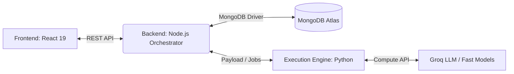
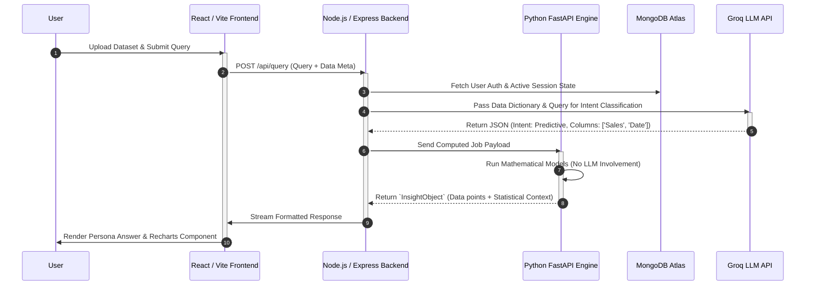

<div align="center">
  

  # Bolt — Unified Analytical Platform
  
  **Your AI-powered data analyst. Talk to your data in plain language, eliminate AI hallucinations, and get instant, rigorous, persona-aware insights.**

  <br />
  <a href="https://talktodata-mt63.onrender.com/">
    
  </a>
  <br />

  [](https://opensource.org/licenses/MIT)
  [](https://reactjs.org/)
  [](https://nodejs.org/)
  [](https://www.python.org/)
  [](https://vitejs.dev/)
</div>

---

## The Problem & Our Solution

In enterprise banking and finance, **Large Language Models (LLMs) have a catastrophic flaw: they hallucinate mathematics.** You cannot trust an LLM to calculate a portfolio's 6-month forecast or identify statistical anomalies with a z-score. Furthermore, professional data visualization tools (like PowerBI or Tableau) are highly restrictive to non-technical users and lack true conversational capabilities.

**Bolt solves this.** 

Built for the **NatWest Hackathon**, Bolt introduces a **Deterministic Decoupled Architecture**. 
We use lightning-fast Groq LLMs *only* to understand human intent (the "What"). The actual computation (the "Math") is entirely delegated to a rigorous, scalable Python backend running pure deterministic algorithms. The result is returned to an ultra-modern React interface that dynamically builds rich, interactive charts. **No hallucinations, zero math errors, just enterprise-grade insights on command.**

---

## Comprehensive Feature Set

### 1. Zero-Hallucination Mathematical Engine
- **Deterministic Python Execution:** Natural language queries are transformed into structured ML job payloads. All calculations (aggregations, forecasts, standard deviations) are securely processed via `Pandas` and `Numpy` in our FastAPI layer.
- **Dynamic Schema Profiling:** When you upload a CSV, Bolt immediately reads the column types, detects complex date formats across 7 global standards, and passes a "Data Dictionary" to the LLM. This guarantees the AI knows exactly what columns it is allowed to ask the Python engine for, preventing hallucinated variables.
- **Universal CSV Loader:** Seamlessly handles ISO-8859, UTF-8, and dirty encodings without requiring users to pre-clean their data.

### 2. Multi-Tiered Advanced Analytics
- **Descriptive Analysis:** Instant multi-dimensional aggregation that enables you to summarize massive datasets effortlessly. Bolt dynamically groups and calculates complex temporal and categorical metrics (e.g., *"Show me a breakdown of total sales by region and user category"*).
- **Diagnostic Analysis (Root Cause):** Uses automatic **Z-Score Anomaly Detection** to scan datasets for statistical outliers. It doesn't just flag them; it runs a contribution analysis to tell you *why* the anomaly happened (e.g., *"Sales dipped 15% due to a massive drop in the Technology sector in the North region"*).
- **Predictive Analysis:** Implements a rolling **6-Month Multi-Period Forecast** that runs over historical time-series data. It automatically calculates the Mean Absolute Percentage Error (MAPE) to grade its own confidence.
- **Comparative Analysis (PoP):** Deep Period-Over-Period delta tracking to instantly measure growth or decay between discrete timeframes.

### 3. State-of-the-Art Dynamic Visualizations
- **Recharts-Driven Coordinates:** The Python engine doesn't just return numbers; it returns an intelligent `MLOutputContract` containing exact `x` and `y` coordinate structures designed for React.
- **Auto-Selecting Chart Typer:** Bolt dynamically selects the optimal chart type based on the statistical calculation. It supports deep visuals including **Waterfalls, Diverging Bars, Composed Area/Lines, and Multi-Axis plots.**
- **Instantly Responsive:** Changing visual orientations or selecting different metrics re-renders instantly on the client UI without expensive re-queries to the server.

### 4. Smart Persona Engine
A CEO and a Data Engineer shouldn't get the same answer to the same question.
- **6 Built-in Personas:** Switch seamlessly between *Beginner, Everyday, SME, Executive, Analyst,* and *Compliance* views.
- **Offline Switching:** If you ask a question as an "Analyst" (seeing p-values and deep statistical nuance), you can swap to "Executive" to get a 2-sentence bottom line instantly. The UI re-interprets the underlying data without spending additional API tokens.

### 5. Unmatched Universal Accessibility (A11y)
- **Audio "Blind Mode":** Traditional charts are a black box for visually impaired employees. By holding the `Spacebar` for 5 seconds, Bolt activates a specialized mode using the Web Speech API to provide an immersive, self-voicing navigation interface that literally reads the insights out loud.
- **Native Voice Input:** Integrated Speech-to-Text allows users to simply talk to their data, perfect for accessibility and executive mobile usage.
- **Global 11-Language i18n:** Not just translated interfaces, but inherently language-aware LLM response generation in: *English, Hindi, Bengali, Telugu, Marathi, Tamil, Spanish, French, Mandarin, Arabic, and German.*
- **Arabic RTL Support:** Total structural interface flipping to respect Right-To-Left language layouts natively.

---

## Architecture & System Workflow

Bolt isolates rapid User Experience (Node/React) from deep computational friction (Python).

### Core Infrastructure Diagram


| Sub-System | Domain / Port | Tech Stack | Responsibility |
|-------|------|-------|---------|
| **Frontend UI** | Port `5173` | React 19, Vite, Tailwind | Presentation Shell, Persona Switcher, Chart Renderer, Voice I/O |
| **Backend API** | Port `5000` | Node.js, Express, Mongoose | Auth, Session State, LLM Intent Routing, File Processing |
| **Execution** | Port `8000` | Python 3, FastAPI, Pandas | Data processing, Forecasting algorithms, Anomaly mapping |

### Data Validation Sequence


---

## Physical Project Structure

```text
Natwest-Hackathon/
├── backend/                # Node.js Orchestration Layer
│   └── src/
│       ├── controllers/    # API Request Handlers 
│       ├── models/         # MongoDB Schemas (User, Session)
│       ├── routes/         # Express endpoints
│       ├── services/       # Groq Interface & Job Dispatcher
│       └── server.js       # App Entry
├── execution_engine/       # Python Mathematical ML Layer
│   ├── data/               # Persistent Datasets
│   ├── uploads/            # Temporary CSV Blob Store
│   └── src/
│       ├── api/            # FastAPI Endpoints
│       ├── core/           # Data Profiling & Cleaning Core
│       ├── models/         # Predictive, Diagnostic & Standard Logic
│       └── main.py         # Uvicorn Setup
├── frontend/               # React 19 Presentation Layer
│   └── src/
│       ├── components/     # Reusable UI (Chat, Shell, Personas)
│       ├── hooks/          # useBlindMode, useVoice
│       ├── locales/        # 11 Language Translation JSONs
│       ├── services/       # API Adapters Configuration
│       ├── i18n.ts         # i18next State Management
│       └── main.tsx        # React DOM Root
└── scripts/
    └── start_all.bat       # Lightning Windows Launcher
```

---

## Quick Start & Deployment

We've made booting a 3-tier enterprise platform locally as easy as running a single file.

> **LIVE DEMO:** Skip the local setup and experience the deployed application immediately here: **[https://talktodata-mt63.onrender.com/](https://talktodata-mt63.onrender.com/)**

### Prerequisites
- **Node.js** v18+ & **Python** 3.10+
- **MongoDB** cluster (Atlas or Local)
- **Groq API Key** (Free at console.groq.com)

### Installation
Clone the repository and set up your `.env` variables.
```bash
git clone https://github.com/Harshitaaaaaaaaaa/Natwest-Hackathon
cd Natwest-Hackathon

# Set your env variables in backend/.env & frontend/.env (MONGODB_URI & GROQ keys)
```

Install the required packages across sub-systems:
```bash
cd frontend && npm install
cd ../backend && npm install
cd ../execution_engine && pip install -r requirements.txt
```

### Execution

**For Windows (One-Click Boot):**
Run the automated batch script to spin up the React server, Node Server, and Python Engine concurrently.
```cmd
scripts\start_all.bat
```

**For Mac/Linux (Multi-terminal Boot):**
```bash
# Terminal 1: Boot Python ML Math Engine
cd execution_engine && python -m uvicorn src.main:app --port 8000 --host 0.0.0.0

# Terminal 2: Boot Node API
cd backend && npm run dev

# Terminal 3: Boot React UI
cd frontend && npm run dev
```

Navigate to [**http://localhost:5173**](http://localhost:5173) to enter the platform. 

> **Note on Testing Data:** 
> For evaluation and testing purposes, we have included sample datasets in the `execution_engine/data/` folder (e.g., `Superstore.csv`). When uploading a file in the UI to run your initial queries, please use this provided example data to experience the full range of Bolt's analytical capabilities.
---

## Business Impact for NatWest

Bolt isn't just a technical prototype; it solves real enterprise bottlenecks:
1. **Immediate Productivity:** Reduces the time-to-insight from hours of analyst manual charting to literal seconds.
2. **Defensible Accuracy:** By walling off the LLMs from doing math, NatWest can ensure that portfolio projections and internal reports aren't skewed by AI hallucinations.
3. **True Inclusivity:** The platform adapts to the user—whether they speak Arabic, are visually impaired, or have absolutely no data science background, they get top-tier enterprise analytics at their fingertips.

---
<div align="center">
  <i>Bolt by Algo-Vengers for the NatWest Hackathon 2026</i>
</div>
